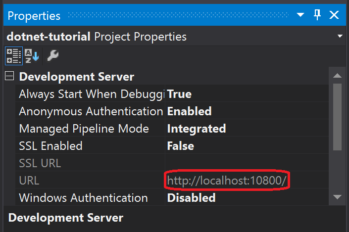
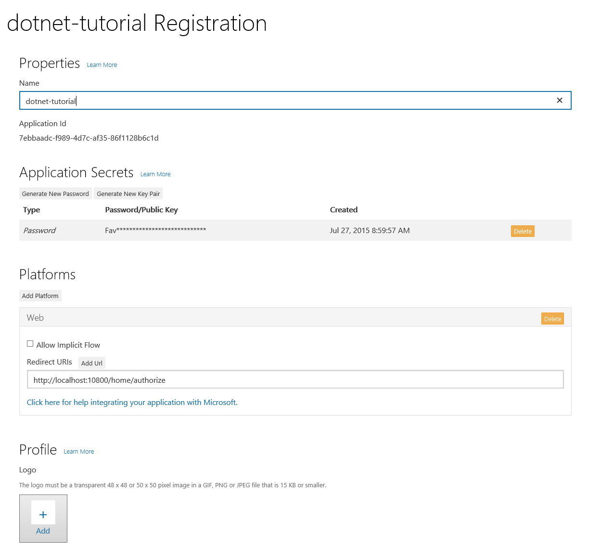
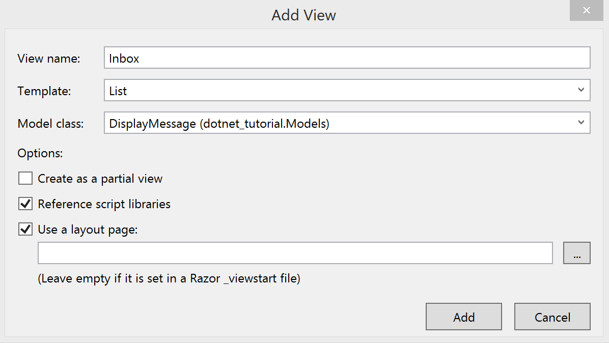
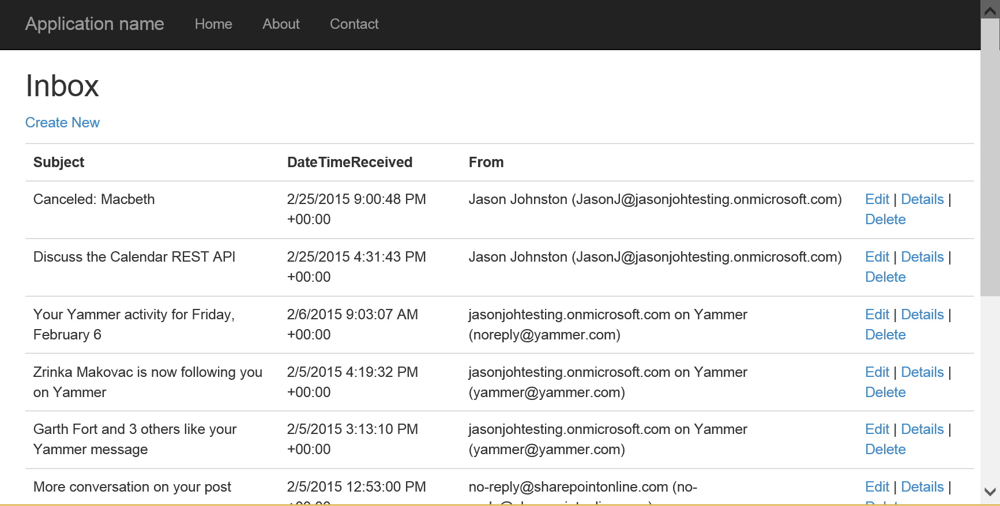

# Getting Started with the Outlook Mail API and ASP.NET #

The purpose of this guide is to walk through the process of creating a simple ASP.NET MVC C# app that retrieves messages in Office 365 or Outlook.com. The source code in this repository is what you should end up with if you follow the steps outlined here.

This tutorial will use the [Microsoft Authentication Library (MSAL)](https://www.nuget.org/packages/Microsoft.Identity.Client) to make OAuth2 calls and the [Microsoft Office 365 Mail, Calendar, and Contacts Library for .NET v2.0](https://www.nuget.org/packages/Microsoft.Office365.OutlookServices-V2.0/) to call the Mail API.

> **NOTE:** If you are downloading this sample, you'll need to do a few things to get it to run.
>
> 1. Open the dotnet-tutorial.sln file.
> 1. Right-click **References** in Solution Explorer and choose **Manage NuGet Packages**.
> 1. Click the **Restore** button in the **Manage NuGet Packages** dialog to download all of the required packages.
> 1. Register an application as described in the [Implementing OAuth2](#implementing-oauth2) section, and put your application ID and password in the appropriate place in `Web.config`.

## Before you begin ##

This guide assumes:

- That you already have Visual Studio 2013 or Visual Studio 2015 installed and working on your development machine. 
- That you have an Office 365 tenant, with access to an administrator account in that tenant, **OR** an Outlook.com developer preview account.

## Create the app ##

Let's dive right in! In Visual Studio, create a new Visual C# ASP.NET Web Application using .NET Framework 4.5. Name the application "dotnet-tutorial".


Select the `MVC` template. Click the `Change Authentication` button and choose "No Authentication". Un-select the "Host in the cloud" checkbox. The dialog should look like the following.


Click OK to have Visual Studio create the project. Once that's done, run the project to make sure everything's working properly by pressing **F5** or choosing **Start Debugging** from the **Debug** menu. You should see a browser open displaying the stock ASP.NET home page. Close your browser.

Now that we've confirmed that the app is working, we're ready to do some real work.

## Designing the app ##

Our app will be very simple. When a user visits the site, they will see a button to log in and view their email. Clicking that button will take them to the Azure login page where they can login with their Office 365 or Outlook.com account and grant access to our app. Finally, they will be redirected back to our app, which will display a list of the most recent email in the user's inbox.

Let's begin by replacing the stock home page with a simpler one. Open the `./Views/Home/Index.cshtml` file. Replace the existing code with the following code.

#### Contents of the `./Views/Home/Index.cshtml` file ####

```C#
@{
    ViewBag.Title = "Home Page";
}

<div class="jumbotron">
    <h1>ASP.NET MVC Tutorial</h1>
    <p class="lead">This sample app uses the Mail API to read messages in your inbox.</p>
    <p><a href="#" class="btn btn-primary btn-lg">Click here to login</a></p>
</div>
```

This is basically repurposing the `jumbotron` element from the stock home page, and removing all of the other elements. The button doesn't do anything yet, but the home page should now look like the following.


Let's also modify the stock error page so that we can pass an error message and display it. Replace the contents of `./Views/Shared/Error.cshtml` with the following code.

#### Contents of the `./Views/Shared/Error.cshtml` file ####

```C#
<!DOCTYPE html>
<html>
<head>
    <meta name="viewport" content="width=device-width" />
    <title>Error</title>
</head>
<body>
    <hgroup>
        <h1>Error.</h1>
        <h2>An error occurred while processing your request.</h2>
    </hgroup>
    <div class="alert alert-danger">@ViewBag.Message</div>
    @if (!string.IsNullOrEmpty(ViewBag.Debug))
    {
    <pre><code>@ViewBag.Debug</code></pre>
    }
</body>
</html>
```

Finally add an action to the `HomeController` class to invoke the error view.

#### The `Error` action in `./Controllers/HomeController.cs` ####

```C#
public ActionResult Error(string message, string debug)
{
    ViewBag.Message = message;
    ViewBag.Debug = debug;
    return View("Error");
}
```

## Implementing OAuth2 ##

Our goal in this section is to make the link on our home page initiate the [OAuth2 Authorization Code Grant flow with Azure AD](https://msdn.microsoft.com/en-us/library/azure/dn645542.aspx). To make things easier, we'll use the [Microsoft Authentication Library (MSAL)](https://www.nuget.org/packages/Microsoft.Identity.Client) to handle our OAuth requests.

Before we proceed, we need to register our app to obtain a client ID and secret. Head over to https://apps.dev.microsoft.com to quickly get a client ID and secret. Using the sign in buttons, sign in with either your Microsoft account (Outlook.com), or your work or school account (Office 365).

Once you're signed in, click the **Add an app** button. Enter `dotnet-tutorial` for the name and click **Create application**. After the app is created, locate the **Application Secrets** section, and click the **Generate New Password** button. Copy the password now and save it to a safe place. Once you've copied the password, click **Ok**.


Locate the **Platforms** section, and click **Add Platform**. Choose **Web**, then enter `http://localhost:<PORT>/Home/Authorize` under **Redirect URIs**, where `<PORT>` is the port number that the Visual Studio Development Server is using for your project. You can locate this by selecting the `dotnet-tutorial` project in Solution Explorer, then checking the value for `URL` in the Properties window.

> **NOTE:** The values in **Redirect URIs** are case-sensitive, so be sure to match the case!



Click **Save** to complete the registration. Copy the **Application Id** and save it along with the password you copied earlier. We'll need those values soon.

Here's what the details of your app registration should look like when you are done.



Open the `Web.config` file and add the following keys inside the `<appSettings>` element:

```xml
<add key="ida:AppID" value="YOUR APP ID" />
<add key="ida:AppPassword" value="YOUR APP PASSWORD" />
<add key="ida:RedirectUri" value="http://localhost:10800" />
<add key="ida:AppScopes" value="https://outlook.office.com/mail.read" />
```

Replace the value of the `ida:AppID` key with the application ID you generated above, and replace the value of the `ida:AppPassword` key with the password you generated above. If the value of your redirect URI is different, be sure to update the value of `ida:RedirectUri`.

The next step is to install the OWIN middleware, MSAL, and Outlook libraries from NuGet. On the Visual Studio **Tools** menu, choose **NuGet Package Manager**, then **Package Manager Console**. To install the OWIN middleware libraries, enter the following commands in the Package Manager Console:

```Powershell
Install-Package Microsoft.Owin.Security.OpenIdConnect
Install-Package Microsoft.Owin.Security.Cookies
Install-Package Microsoft.Owin.Host.SystemWeb
```

Next install the **Microsoft Authentication Library** with the following command:

```Powershell
Install-Package Microsoft.Identity.Client -Pre
```

Finally install the **Microsoft Office 365 Mail, Calendar and Contacts Library** with the following command:

```Powershell
Install-Package Microsoft.Office365.OutlookServices-V2.0
```

### Back to coding ###

Now we're all set to do the sign in. Let's start by wiring the OWIN middleware to our app. Right-click the **App_Start** folder in **Project Explorer** and choose **Add**, then **New Item**. Choose the **OWIN Startup Class** template, name the file `Startup.cs`, and click **Add**. Replace the entire contents of this file with the following code.

```C#
using System;
using System.Configuration;
using System.IdentityModel.Claims;
using System.IdentityModel.Tokens;
using System.Threading.Tasks;
using System.Web;

using Microsoft.IdentityModel.Protocols;
using Microsoft.Owin;
using Microsoft.Owin.Security;
using Microsoft.Owin.Security.Cookies;
using Microsoft.Owin.Security.Notifications;
using Microsoft.Owin.Security.OpenIdConnect;

using Owin;


[assembly: OwinStartup(typeof(dotnet_tutorial_test.App_Start.Startup))]

namespace dotnet_tutorial_test.App_Start
{
    public class Startup
    {
        public static string appId = ConfigurationManager.AppSettings["ida:AppId"];
        public static string appPassword = ConfigurationManager.AppSettings["ida:AppPassword"];
        public static string redirectUri = ConfigurationManager.AppSettings["ida:RedirectUri"];
        public static string[] scopes = ConfigurationManager.AppSettings["ida:AppScopes"]
          .Replace(' ', ',').Split(new char[] { ',' }, StringSplitOptions.RemoveEmptyEntries);
          
        public void Configuration(IAppBuilder app)
        {
            app.SetDefaultSignInAsAuthenticationType(CookieAuthenticationDefaults.AuthenticationType);

            app.UseCookieAuthentication(new CookieAuthenticationOptions());

            app.UseOpenIdConnectAuthentication(
              new OpenIdConnectAuthenticationOptions
              {
                  ClientId = appId,
                  Authority = "https://login.microsoftonline.com/common/v2.0",
                  Scope = "openid offline_access profile email " + string.Join(" ", scopes),
                  RedirectUri = redirectUri,
                  PostLogoutRedirectUri = "/",
                  TokenValidationParameters = new TokenValidationParameters
                  {
                      // For demo purposes only, see below
                      ValidateIssuer = false

                      // In a real multitenant app, you would add logic to determine whether the
                      // issuer was from an authorized tenant
                      //ValidateIssuer = true,
                      //IssuerValidator = (issuer, token, tvp) =>
                      //{
                      //  if (MyCustomTenantValidation(issuer))
                      //  {
                      //    return issuer;
                      //  }
                      //  else
                      //  {
                      //    throw new SecurityTokenInvalidIssuerException("Invalid issuer");
                      //  }
                      //}
                  },
                  Notifications = new OpenIdConnectAuthenticationNotifications
                  {
                      AuthenticationFailed = OnAuthenticationFailed,
                      AuthorizationCodeReceived = OnAuthorizationCodeReceived
                  }
              }
            );
        }

        private Task OnAuthenticationFailed(AuthenticationFailedNotification<OpenIdConnectMessage,
          OpenIdConnectAuthenticationOptions> notification)
        {
            notification.HandleResponse();
            string redirect = "/Home/Error?message=" + notification.Exception.Message;
            if (notification.ProtocolMessage != null && !string.IsNullOrEmpty(notification.ProtocolMessage.ErrorDescription))
            {
                redirect += "&debug=" + notification.ProtocolMessage.ErrorDescription;
            }
            notification.Response.Redirect(redirect);
            return Task.FromResult(0);
        }

        private Task OnAuthorizationCodeReceived(AuthorizationCodeReceivedNotification notification)
        {
            notification.HandleResponse();
            notification.Response.Redirect("/Home/Error?message=See Auth Code Below&debug=" + notification.Code);
            return Task.FromResult(0);
        }
    }
}
```

Let's continue by adding a `SignIn` action to the `HomeController` class. Open the `.\Controllers\HomeController.cs` file. At the top of the file, add the following lines:

```C#
using System.Security.Claims;
using System.Threading.Tasks;
using Microsoft.Identity.Client;
using Microsoft.Owin.Security;
using Microsoft.Owin.Security.Cookies;
using Microsoft.Owin.Security.OpenIdConnect;
using Microsoft.Office365.OutlookServices;
```

Now add a new method called `SignIn` to the `HomeController` class.

#### `SignIn` action in `./Controllers/HomeController.cs` ####

```C#
public void SignIn()
{
    if (!Request.IsAuthenticated)
    {
        // Signal OWIN to send an authorization request to Azure
        HttpContext.GetOwinContext().Authentication.Challenge(
            new AuthenticationProperties { RedirectUri = "/" },
            OpenIdConnectAuthenticationDefaults.AuthenticationType);
    }
}
```

Finally, let's update the home page so that the login button invokes the `SignIn` action.

#### Updated contents of the `./Views/Home/Index.cshtml` file ####

```C#
@{
    ViewBag.Title = "Home Page";
}

<div class="jumbotron">
    <h1>ASP.NET MVC Tutorial</h1>
    <p class="lead">This sample app uses the Mail API to read messages in your inbox.</p>
    <p><a href="@Url.Action("SignIn", "Home", null, Request.Url.Scheme)" class="btn btn-primary btn-lg">Click here to login</a></p>
</div>
```

Save your work and run the app. Click on the button to sign in. After signing in, you should be redirected to the error page, which displays an authorization code. Now let's do something with it.

### Exchanging the code for a token ###

Now let's update the `OnAuthorizationCodeReceived` function to retrieve a token. In `./App_Start/Startup.cs`, add the following line to the top of the file:

```C#
using Microsoft.Identity.Client;
```

Replace the current `OnAuthorizationCodeReceived` function with the following.

#### Updated `OnAuthorizationCodeReceived` action in `./App_Start/Startup.cs` ####

```C#
// Note the function signature is changed!
private async Task OnAuthorizationCodeReceived(AuthorizationCodeReceivedNotification notification)
{
    ConfidentialClientApplication cca = new ConfidentialClientApplication(
        appId, redirectUri, new ClientCredential(appPassword), null);

    string message;
    string debug;

    try
    {
        var result = await cca.AcquireTokenByAuthorizationCodeAsync(scopes, notification.Code);
        message = "See access token below";
        debug = result.Token;
    }
    catch (MsalException ex)
    {
        message = "AcquireTokenByAuthorizationCodeAsync threw an exception";
        debug = ex.Message;
    }

    notification.HandleResponse();
    notification.Response.Redirect("/Home/Error?message=" + message + "&debug=" + debug);
}
```

Save your changes and restart the app. This time, after you sign in, you should see an access token displayed. Now that we can retrieve the access token, we need a way to save the token so the app can use it. The MSAL library defines a `TokenCache` interface, which we can use to store the tokens. Since this is a tutorial, we'll just implement a basic cache stored in the session.

Create a new folder in the project called `TokenStorage`. Add a class in this folder named `SessionTokenCache`, and replace the contents of that file with the following code (borrowed from https://github.com/Azure-Samples/active-directory-dotnet-webapp-openidconnect-v2).

#### Contents of the `./TokenCache/SessionTokenCache.cs` file ####

```C#
using System.Threading;
using System.Web;

using Microsoft.Identity.Client;

namespace dotnet_tutorial.TokenStorage 
{
    // Adapted from https://github.com/Azure-Samples/active-directory-dotnet-webapp-openidconnect-v2
    public class SessionTokenCache : TokenCache
    {
        private static ReaderWriterLockSlim sessionLock = new ReaderWriterLockSlim(LockRecursionPolicy.NoRecursion); 
        string userId = string.Empty; 
        string cacheId = string.Empty; 
        HttpContextBase httpContext = null;

        public SessionTokenCache(string userId, HttpContextBase httpContext)
        {
            this.userId = userId;
            cacheId = userId + "_TokenCache";
            this.httpContext = httpContext;
            BeforeAccess = BeforeAccessNotification;
            AfterAccess = AfterAccessNotification;
            Load();
        }

        public override void Clear(string clientId)
        {
            base.Clear(clientId);
            httpContext.Session.Remove(cacheId);
        }

        private void Load()
        {
            sessionLock.EnterReadLock();
            Deserialize((byte[])httpContext.Session[cacheId]);
            sessionLock.ExitReadLock();
        }

        private void Persist()
        {
            sessionLock.EnterReadLock();

            // Optimistically set HasStateChanged to false. 
            // We need to do it early to avoid losing changes made by a concurrent thread.
            HasStateChanged = false;

            httpContext.Session[cacheId] = Serialize();
            sessionLock.ExitReadLock();
        }

        // Triggered right before ADAL needs to access the cache. 
        private void BeforeAccessNotification(TokenCacheNotificationArgs args)
        {
            // Reload the cache from the persistent store in case it changed since the last access. 
            Load();
        }

        // Triggered right after ADAL accessed the cache.
        private void AfterAccessNotification(TokenCacheNotificationArgs args)
        {
            // if the access operation resulted in a cache update
            if (HasStateChanged)
            {
                Persist();
            }
        }
    }
}
```

Now let's update the `OnAuthorizationCodeReceived` function to use our new cache. 

Add the following lines to the top of the `Startup.cs` file:

```C#
using dotnet_tutorial.TokenStorage;
```

Replace the current `OnAuthorizationCodeReceived` function with this one.

#### New `OnAuthorizationCodeReceived` in `./App_Start/Startup.cs` ####

```C#
private async Task OnAuthorizationCodeReceived(AuthorizationCodeReceivedNotification notification)
{
    // Get the signed in user's id and create a token cache
    string signedInUserId = notification.AuthenticationTicket.Identity.FindFirst(ClaimTypes.NameIdentifier).Value;
    SessionTokenCache tokenCache = new SessionTokenCache(signedInUserId, 
        notification.OwinContext.Environment["System.Web.HttpContextBase"] as HttpContextBase);

    ConfidentialClientApplication cca = new ConfidentialClientApplication(
        appId, redirectUri, new ClientCredential(appPassword), tokenCache);

    try
    {
        var result = await cca.AcquireTokenByAuthorizationCodeAsync(scopes, notification.Code);
    }
    catch (MsalException ex)
    {
        string message = "AcquireTokenByAuthorizationCodeAsync threw an exception";
        string debug = ex.Message;
        notification.HandleResponse();
        notification.Response.Redirect("/Home/Error?message=" + message + "&debug=" + debug);
    }
}
```

Since we're saving stuff in the session, let's also add a `SignOut` action to the `HomeController` class. Add the following lines to the top of the `HomeController.cs` file:

```C#
using dotnet_tutorial.TokenStorage;
```

Then add the `SignOut` action.

#### `SignOut` action in `./Controllers/HomeController.cs` #####

```C#
public void SignOut()
{
    if (Request.IsAuthenticated)
    {
        string userId = ClaimsPrincipal.Current.FindFirst(ClaimTypes.NameIdentifier).Value;

        if (!string.IsNullOrEmpty(userId))
        {
            string appId = ConfigurationManager.AppSettings["ida:AppId"];
            // Get the user's token cache and clear it
            SessionTokenCache tokenCache = new SessionTokenCache(userId, HttpContext);
            tokenCache.Clear(appId);
        }
    }
    // Send an OpenID Connect sign-out request. 
    HttpContext.GetOwinContext().Authentication.SignOut(
        CookieAuthenticationDefaults.AuthenticationType);
    Response.Redirect("/");
}
```

Now if you restart the app and sign in, you'll notice that the app redirects back to the home page, with no visible result. Let's update the home page so that it changes based on if the user is signed in or not.

First let's update the `Index` action in `HomeController.cs` to get the user's display name. Replace the existing `Index` function with the following code.

#### Updated `Index` action in `./Controllers/HomeController.cs` ####

```C#
public ActionResult Index()
{
    if (Request.IsAuthenticated)
    {
        string userName = ClaimsPrincipal.Current.FindFirst("name").Value;
        string userId = ClaimsPrincipal.Current.FindFirst(ClaimTypes.NameIdentifier).Value;
        if (string.IsNullOrEmpty(userName) || string.IsNullOrEmpty(userId))
        {
            // Invalid principal, sign out
            return RedirectToAction("SignOut");
        }

        // Since we cache tokens in the session, if the server restarts
        // but the browser still has a cached cookie, we may be
        // authenticated but not have a valid token cache. Check for this
        // and force signout.
        SessionTokenCache tokenCache = new SessionTokenCache(userId, HttpContext);
        if (tokenCache.Count <= 0)
        {
            // Cache is empty, sign out
            return RedirectToAction("SignOut");
        }

        ViewBag.UserName = userName;
    }
    return View();
}
```

Next, replace the existing `Index.cshtml` code with the following.

#### Updated contents of `./Views/Home/Index.cshtml` ####

```C#
@{
    ViewBag.Title = "Home Page";
}

<div class="jumbotron">
    <h1>ASP.NET MVC Tutorial</h1>
    <p class="lead">This sample app uses the Mail API to read messages in your inbox.</p>
    @if (Request.IsAuthenticated)
    {
        <p>Welcome, @(ViewBag.UserName)!</p>
    }
    else
    {
        <p><a href="@Url.Action("SignIn", "Home", null, Request.Url.Scheme)" class="btn btn-primary btn-lg">Click here to login</a></p>
    }
</div>
```

Finally, let's add some new menu items to the navigation bar if the user is signed in. Open the `./Views/Shared/_Layout.cshtml` file. Locate the following lines of code:

```C#
<ul class="nav navbar-nav">
    <li>@Html.ActionLink("Home", "Index", "Home")</li>
    <li>@Html.ActionLink("About", "About", "Home")</li>
    <li>@Html.ActionLink("Contact", "Contact", "Home")</li>
</ul>
```

Replace those lines with this code:

```C#
<ul class="nav navbar-nav">
    <li>@Html.ActionLink("Home", "Index", "Home")</li>
    @if (Request.IsAuthenticated)
    {
        <li>@Html.ActionLink("Inbox", "Inbox", "Home")</li>
        <li>@Html.ActionLink("Sign Out", "SignOut", "Home")</li>
    }
</ul>
```

Now if you save your changes and restart the app, the home page should display the logged on user's name and show two new menu items in the top navigation bar after you sign in. Now that we've got the signed in user and an access token, we're ready to call the Mail API.

## Using the Mail API ##

Let's start by adding a new function to the `HomeController` class to get the user's access token. In this function we'll use MSAL and our token cache. If there is a valid non-expired token in the cache, MSAL will return it. If it is expired, MSAL will refresh the token for us.

#### `GetAccessToken` function in `./Controllers/HomeController.cs` ####

Now let's test our new function. Add a new function to the `HomeController` class called `Inbox`.

#### `Inbox` action in `./Controllers/HomeController.cs` ####

```C#
public async Task<ActionResult> Inbox()
{
    string token = await GetAccessToken();
    if (string.IsNullOrEmpty(token))
    {
        // If there's no token in the session, redirect to Home
        return Redirect("/");
    }

    return Content(string.Format("Token: {0}", token));
}
```

If you run the app now and click the **Inbox** menu item after logging in, you should see the access token displayed in the browser. Let's put it to use.

Our first task with the Mail API will be to get the user's email address. You'll see why we do this soon. Add another function to the `HomeController` class called `GetUserEmail`.

#### `GetUserEmail` function in `./Controllers/HomeController.cs` ####

```C#
public async Task<string> GetUserEmail()
{
    OutlookServicesClient client = 
        new OutlookServicesClient(new Uri("https://outlook.office.com/api/v2.0"), GetAccessToken);

    try
    {
        var userDetail = await client.Me.ExecuteAsync();
        return userDetail.EmailAddress;
    }
    catch (MsalException ex)
    {
        return string.Format("#ERROR#: Could not get user's email address. {0}", ex.Message);
    }
}
```

Update the `Inbox` function with the following code.

#### Updated `Inbox` action in `./Controllers/HomeController.cs` ####

```C#
public async Task<ActionResult> Inbox()
{
    string token = await GetAccessToken();
    if (string.IsNullOrEmpty(token))
    {
        // If there's no token in the session, redirect to Home
        return Redirect("/");
    }

    string userEmail = await GetUserEmail();

    OutlookServicesClient client = 
        new OutlookServicesClient(new Uri("https://outlook.office.com/api/v2.0"), GetAccessToken);

    client.Context.SendingRequest2 += new EventHandler<Microsoft.OData.Client.SendingRequest2EventArgs> (
        (sender, e) => InsertXAnchorMailboxHeader(sender, e, email));
        
    try
    {
        var mailResults = await client.Me.Messages
                            .OrderByDescending(m => m.ReceivedDateTime)
                            .Take(10)
                            .Select(m => new { m.Subject, m.ReceivedDateTime, m.From })
                            .ExecuteAsync();

        string content = "";

        foreach (var msg in mailResults.CurrentPage)
        {
            content += string.Format("Subject: {0}<br/>", msg.Subject);
        }

        return Content(content);
    }
    catch (MsalException ex)
    {
        return RedirectToAction("Error", "Home", new { message = "ERROR retrieving messages", debug = ex.Message }); 
    }
}
```

To summarize the new code in the `mail` function:

- It creates an `OutlookServicesClient` object.
- It adds an event handler for the `SendingRequest2` event on the `OutlookServicesClient` object. This is where our work to get the user's email pays off. The event handler (which we will implement shortly) will add an `X-AnchorMailbox` HTTP header to the outgoing API requests. Setting this header to the user's mailbox allows the API endpoint to route API calls to the appropriate backend mailbox server more efficiently.
- It issues a GET request to the URL for inbox messages, with the following characteristics:
	- It uses the `OrderBy()` function with a value of `ReceivedDateTime desc` to sort the results by ReceivedDateTime.
	- It uses the `Take()` function with a value of `10` to limit the results to the first 10.
	- It uses the `Select()` function to limit the fields returned to only those that we need.
- It loops over the results and prints out the subject.

Now let's implement the `InsertXAnchorMailboxHeader` function.

#### `InsertXAnchorMailboxHeader` function in `./Controllers/HomeController.cs` ####

```C#
private void InsertXAnchorMailboxHeader(object sender, Microsoft.OData.Client.SendingRequest2EventArgs e, string email)
{
    e.RequestMessage.SetHeader("X-AnchorMailbox", email);
}
```

If you restart the app now, you should get a very basic listing of email subjects. However, we can use the features of MVC to do better than that.

### Displaying the results ###

MVC can generate views based on a model. So let's start by creating a model that represents the properties of a message that we'd like to display. For our purposes, we'll choose `Subject`, `ReceivedDateTime`, and `From`. In Visual Studio's Solution Explorer, right-click the `./Models` folder and choose **Add**, then **Class**. Name the class `DisplayMessage` and click **Add**.

Open the `./Models/DisplayMessage.cs` file and replace the empty class definition with the following.

#### `DisplayMessage` class definition ####

```C#
public class DisplayMessage
{
    public string Subject { get; set; }
    public DateTimeOffset ReceivedDateTime { get; set; }
    public string From { get; set; }

    public DisplayMessage(string subject, DateTimeOffset? dateTimeReceived, 
        Microsoft.Office365.OutlookServices.Recipient from)
    {
        this.Subject = subject;
        this.ReceivedDateTime = (DateTimeOffset)dateTimeReceived;
        this.From = from != null ? string.Format("{0} ({1})", from.EmailAddress.Name,
                        from.EmailAddress.Address) | "EMPTY";
    }
}
```

All this class does is expose the three properties of the message we want to display.

Now that we have a model, let's create a view based on it. In Solution Explorer, right-click the `./Views/Home` folder and choose **Add**, then **View**. Enter `Inbox` for the **View name**. Change the **Template** field to `List`, and choose `DisplayMessage (dotnet_tutorial.Models)` for the **Model class**. Leave everything else as default values and click **Add**.



Just one more thing to do. Let's update the `Inbox` function to use our new model and view. 

#### Updated `Inbox` action in `./Controllers/HomeController.cs` ####

```C#
public async Task<ActionResult> Inbox()
{
    string token = await GetAccessToken();
    if (string.IsNullOrEmpty(token))
    {
        // If there's no token in the session, redirect to Home
        return Redirect("/");
    }

    string userEmail = await GetUserEmail();

    OutlookServicesClient client = 
        new OutlookServicesClient(new Uri("https://outlook.office.com/api/v2.0"), GetAccessToken);

    client.Context.SendingRequest2 += new EventHandler<Microsoft.OData.Client.SendingRequest2EventArgs> (
        (sender, e) => InsertXAnchorMailboxHeader(sender, e, userEmail));
        
    try
    {
        var mailResults = await client.Me.Messages
                            .OrderByDescending(m => m.ReceivedDateTime)
                            .Take(10)
                            .Select(m => new Models.DisplayMessage(m.Subject, m.ReceivedDateTime, m.From))
                            .ExecuteAsync();

        return View(mailResults.CurrentPage);
    }
    catch (MsalException ex)
    {
        return RedirectToAction("Error", "Home", new { message = "ERROR retrieving messages", debug = ex.Message }); 
    }
}
```

The changes here are minimal. Instead of building a string with the results, we instead create a new `DisplayMessage` object within the `Select` function. This causes the `mailResults.CurrentPage` collection to be a collection of `DisplayMessage` objects, which is perfect for our view.

Save your changes and run the app. You should now get a list of messages that looks something like this.



## Next Steps ##

Now that you've created a working sample, you may want to learn more about the [capabilities of the Mail API](https://msdn.microsoft.com/office/office365/APi/mail-rest-operations). If your sample isn't working, and you want to compare, you can download the end result of this tutorial from [GitHub](https://github.com/jasonjoh/dotnet-tutorial).

## Copyright ##

Copyright (c) Microsoft. All rights reserved.

----------
Connect with me on Twitter [@JasonJohMSFT](https://twitter.com/JasonJohMSFT)

Follow the [Outlook/Exchange Dev Blog](http://blogs.msdn.com/b/exchangedev/)